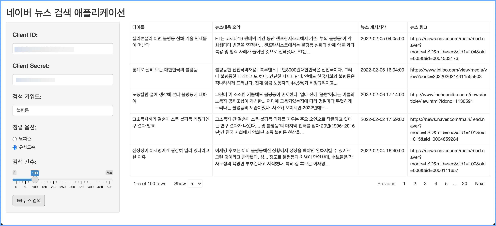

```{r setup, include=FALSE}
knitr::opts_chunk$set(echo = TRUE, 
                      message = FALSE, 
                      warning = FALSE, 
                      collapse = FALSE,
                      fig.align = "center")

library(shiny)
library(htmltools)
```

```{r news-app, echo=FALSE, out.width = "50%"}

```

```{r, preface, echo=FALSE}
div(class = "preface", 
    h3("들어가기"),
    "공격이 최선의 방어라는 격투기 격언이 있습니다. Shiny의 경우는", strong("실제로 애플리케이션을 개발해 보는 것이 최선의 학습"), "입니다.", br(),
    "간단하지만, 유용한 애플리케이션을 만들어 볼까요? 걱정할 필요 없습니다. 천천히 따라오세요",
    style = "margin-bottom: 40px;")
```

# 애플리케이션 설계
     
## 기능 설계

네이버 뉴스 검색 애플리케이션의 기능은 다음과 같이 정의합니다.

* 입력 기능
    - 사용자 인증을 위한 Client ID, Client Secret 입력
    - 검색하려는 뉴스 키워드 입력
    - 정렬 옵션 선택
        - 날짜순 정렬
        - 유사도순 정렬
    - 검색건수 입력    
* 출력 기능
    - 검색 뉴스 테이블 출력
        - 타이틀
        - 뉴스내용 요약
        - 뉴스 게시시간
        - 뉴스 링크
            - 하이퍼링크를 걸어서, 클릭하면 해당 브라우저 창을 열어 뉴스화면 이동 
        

## 사용자 인터페이스 설계

* 페이지
    - fluidPage
* 레이아웃
    - sidebarLayout
* 패널
    - sidebarPanel
        - 입력 위젯 위치
    - mainPanel
        - 출력 위젯 위치    
* 입력 위젯
    - textInput
      - Client ID, Client Secret, 검색 키워드
    - radioButtons  
      - 정렬 옵션 선택
    - sliderInput
      - 검색건수
    - actionButton
      - 뉴스 검색 버튼
* 출력 위젯
    - reactable
        - 검색 결과 출력
 
# 애플리케이션 코드

## UI Side

```{r, eval=FALSE}
# UI Side
ui <- fluidPage(
    # Application title
    titlePanel("네이버 뉴스 검색 애플리케이션"),

    # Sidebar with a slider input for number of bins 
    sidebarLayout(
        sidebarPanel(
            textInput("client_id", 
                      label = h4("Client ID:"), 
                      value = ""),
            textInput("client_secret", 
                      label = h4("Client Secret:"), 
                      value = ""),            
            textInput("keyword", 
                      label = h4("검색 키워드:"), 
                      value = ""),
            radioButtons("sort", label = h4("정렬 옵션:"),
                         choices = list("날짜순" = "date", "유사도순" = "sim"), 
                         selected = "date"),           
            sliderInput("max_record", label = h4("검색 건수:"), min = 0, 
                        max = 500, value = 100),
            actionButton("search_keyword", label = "뉴스 검색", 
                         icon = icon("newspaper")),
            width = 3
        ),

        # Reactable에 검색 결과 리스트업
        mainPanel(
            reactableOutput("news_list"),
            width = 9
        )
    )
)

```

## Server Side

```{r, eval=FALSE}
# Server Side
server <- function(input, output) {
    output$news_list <- renderReactable({
        # 뉴스 검색 리스트의 초기화 출력
        init_data <- data.frame(
            title = character(0),
            description = character(0),
            publish_date = character(0),
            link = character(0),
            stringsAsFactors = FALSE
        )
        
        reactable(
            init_data,
            defaultColDef = colDef(
                align = "left"
            ),
            columns = list(
                title = colDef(
                    name = "타이틀",
                    width = 250,
                ),
                description = colDef(name = "뉴스내용 요약"),
                publish_date = colDef(
                    name = "뉴스 계시시간",
                    width = 150,
                ),
                link = colDef(
                    name = "뉴스 링크",
                    width = 250#,
                    # cell = function(value) {
                    #     print(value)
                    #     cat(value)
                    #     htmltools::tags$a(href = value, target = "_blank", value)
                    # }
                )    
            ),
            showPageSizeOptions = TRUE,
            pageSizeOptions = c(5, 10, 15), 
            defaultPageSize = 5,
            bordered = TRUE,
            highlight = TRUE
        )
    })
    
    observeEvent(input$search_keyword, {
        # 3개의 텍스트는 반드시 입력해야 함
        req(input$keyword)
        req(input$client_id)
        req(input$client_secret)
        
        # 네이버 오픈 API 호출
        search_list <- koscrap::search_naver(
            query = input$keyword, 
            sort  = input$sort,
            chunk = min(input$max_record, 100),
            max_record = input$max_record,
            do_done = TRUE,
            client_id = input$client_id, 
            client_secret = input$client_secret) %>%
            mutate(title = title_text) %>% 
            mutate(description = description_text) %>% 
            mutate(publish_date = stringr::str_remove_all(publish_date, 
                                                          "[[:alpha:]]")) %>% 
            select(title, description, publish_date, link)
            
        updateReactable("news_list", 
                        data = search_list)
    })
}
```

## 사용 패키지 및 애플리케이션 호출

### 사용 패키지
```{r, eval=FALSE}
library("shiny")
library("dplyr")
library("koscrap")
library("reactable")
library("htmltools")
```

### 애플리케이션 호출
```{r, eval=FALSE}
# Run the application 
shinyApp(ui = ui, server = server)
```

# 애플리케이션 실행

## 애플리케이션 실행 화면

애플리케이션을 실행하면 다음과 같의 화면을 얻을 수 있습니다.


